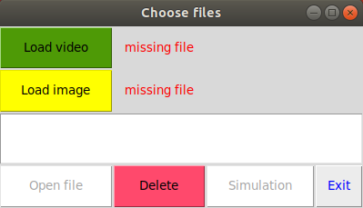
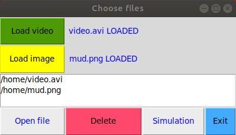
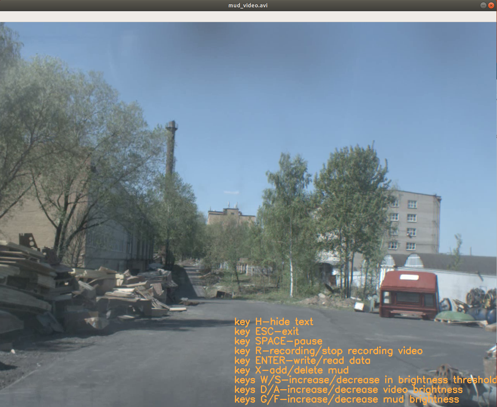
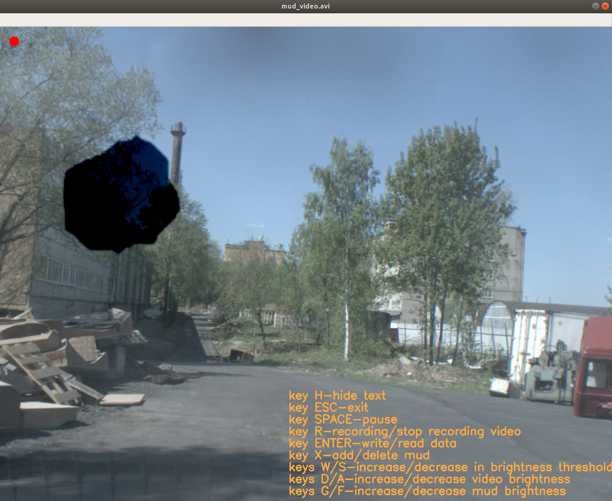

# Аннотация
GUI приложение для симуляции грязи на видео

## Поддерживаемые платформы
* Linux 

## Требования:
* python3, библиотеки:
  * sys
  * os
  * nummpy
  * cv2
  * tkinter

### Запуск
```
python3 mud_simulation_on_the_video.py
```

# Описание
Запуск осуществляется командой
```
python3 mud_simulation_on_the_video.py
```
<p align="center">
</p>

Пользователю предлагается выбрать видео, на которое будут накладываться картинка, а также сама картинка.
<p align="center">
</p>

После нажатия кнопки "simulation" воспроизводится видео. Справа на видео есть подсказки.
<p align="center">
</p>
Подсказки на клавиши:

* H - Спрятать / показать надпись на видео
* ESC - Выход из программы
* SPACE - Пауза
* R - Запись / остановка записи видео
* Запись / загрузка данных из текстового файла
* X - Наложение / удаление грязи
* W/S - Увеличение / уменьшение порога яркости
* D/A - Увеличение / уменьшение яркости видео
* G/F - Увеличение / уменьшение яркости грязи

Пример наложения грязи представлен на картинке.
<p align="center">
</p>


